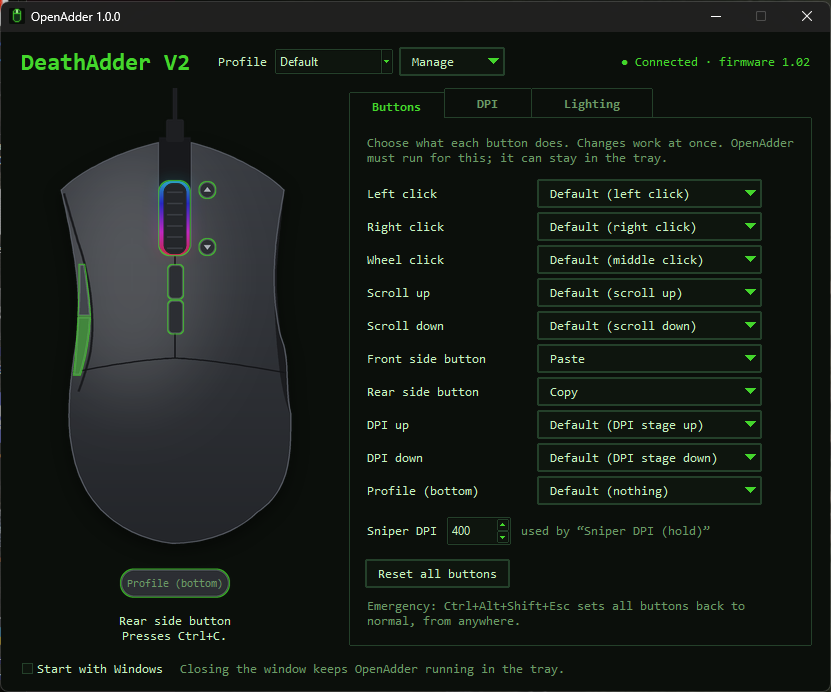

# OpenAdder

**Change the buttons, DPI and lighting of your Razer DeathAdder V2 — without Razer Synapse, without an account, and without an internet connection.**

OpenAdder is a small, free, open-source program for Windows. It uses about 19 MB of memory and does not run any background services.

## What it does

- **Buttons:** give any of the 10 buttons a new job: a key combination, a mouse button, a media key, a DPI change, a profile change, or a program or script to start.
- **DPI:** set up to 5 speed stages, and the polling rate (125, 500 or 1000 Hz).
- **Lighting:** colour, effect and brightness of the logo and the scroll wheel.
- **Profiles:** keep different setups (for example "Games" and "Work") and switch between them.

DPI and lighting are saved on the mouse, so they also work on other computers. The button changes work while OpenAdder runs (it sits quietly in the system tray).

OpenAdder works with the **Razer DeathAdder V2** (wired) on **Windows 10 and 11**.

## Download and install

1. Go to the [**Releases page**](../../releases/latest).
2. Download **`OpenAdder-…-Setup.exe`**.
3. Open the file and follow the steps.

> **"Windows protected your PC"?** This message appears for new programs that are not signed with a paid certificate.
> Click **More info**, then **Run anyway**. OpenAdder is open source: anyone can check the code on this page.

**Portable version (no installation):** download `OpenAdder-…-portable.zip`, right-click it, choose **Extract All**, and open `OpenAdder.exe` in the extracted folder. Do not start it from inside the zip file.

## First start

1. **Close Razer Synapse** if it is installed (or uninstall it). Synapse and OpenAdder must not control the mouse at the same time.
2. Start OpenAdder. At the top right it shows **● Connected** when it finds your mouse.
3. Point at a part of the mouse picture to see what it does. Click it to change it.

When you close the window, OpenAdder keeps running in the **system tray** (the small icons next to the clock), so your buttons keep working. Click the tray icon to open the window again. To start OpenAdder automatically, tick **Start with Windows**.

## Everyday use

| To … | Do this |
|---|---|
| Change a button | Click it in the picture or in the list, then choose a new job from the menu. |
| Use a key combination | In the button's menu, choose **Record keys…**, press the keys, and click **Save**. |
| Start a program or script | In the button's menu, choose **Run a program or script…** and pick the file. |
| Change the speed | **DPI** tab. Changes are saved on the mouse by themselves. |
| Change the lighting | **Lighting** tab. |
| Make a second setup | **Manage → New profile**. Switch with the **Profile** list, the tray menu, or a mouse button set to **Next profile**. |
| Undo everything | **Manage → Reset everything…** |

**Emergency:** if a button change makes the mouse hard to use, press **Ctrl + Alt + Shift + Esc**. All buttons do their normal job again, from anywhere. Clicks inside the OpenAdder window are never changed, so you can always fix things there.

## Questions and problems

**"Mouse not found"**
Check that the mouse is plugged in and that Razer Synapse is closed. OpenAdder connects by itself when you plug the mouse in.

**My buttons stopped working after a restart.**
OpenAdder must run for the button changes. Tick **Start with Windows**.

**A game ignores my button changes.**
Some games with anti-cheat software block changed input. DPI and lighting still work, because they are saved on the mouse.

**Does OpenAdder change my mouse permanently?**
Only DPI, polling rate and lighting, the same settings that Synapse saves. Use **Manage → Reset everything…** to go back to the factory settings.

**How do I uninstall it?**
Windows **Settings → Apps → Installed apps → OpenAdder → Uninstall**. The portable version: delete its folder. Your settings are in `%APPDATA%\OpenAdder` and can be deleted too.

**Does it support other Razer mice?**
Not yet. See [docs/DEVELOPMENT.md](docs/DEVELOPMENT.md) if you want to help.

**Is it safe?**
OpenAdder only talks to your mouse, through the normal Windows USB driver. It does not connect to the internet and collects no data.

## For developers

How it works, how to build it, and how to run the tests: [docs/DEVELOPMENT.md](docs/DEVELOPMENT.md).

## Credits and license

- [OpenRazer](https://github.com/openrazer/openrazer) (GPL-2.0): mouse protocol and driver-mode knowledge.
- [gpoulios/deathadderv2](https://github.com/gpoulios/deathadderv2) (GPL-3.0): DPI stage format tested on this mouse.
- [Snakecharmer](https://github.com/asavs/snakecharmer) (GPL-2.0-or-later): outline of the mouse picture.

OpenAdder is licensed under the **GNU General Public License v2.0 or later**. See [LICENSE](LICENSE).

OpenAdder is not affiliated with Razer Inc. "Razer" and "DeathAdder" are trademarks of Razer Inc.
